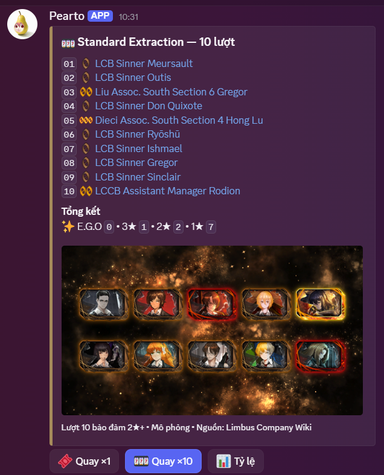

# 🎶Tracen Jukebox

Bot Discord đa chức năng viết bằng Python, kết hợp nghe nhạc, tải media, trợ lý AI, kiến thức Limbus Company và tìm ảnh Danbooru.

> Dự án phát triển từ mã nguồn liên quan đến Ryuz-V/Eva Music Bot và đã được chỉnh sửa đáng kể cho nhu cầu sử dụng riêng.

[](LICENSE)

## ⚡Tính năng

### 🎶Nhạc

- Phát từ từ khóa, YouTube, SoundCloud hoặc Spotify track; mỗi server có queue và trạng thái riêng.
- Music Panel Components V2: pause/resume, previous/next, loop track/queue, autoplay, yêu thích, playlist và tải MP3 riêng tư.
- Queue nâng cao, lịch sử nghe, favorites, playlist cá nhân/chia sẻ, `/stats` và `/wrapped` được lưu bằng SQLite.
- Lyrics từ LRCLIB, radio internet, chế độ 24/7, sleep timer và tự rời voice khi không hoạt động.
- Preload bài kế tiếp, cache âm thanh và chuẩn hóa khoảng `-16 LUFS`; radio hoặc bài dài được stream trực tiếp.

### ⬇️Tải media

- `/download` hỗ trợ YouTube, TikTok và X/Twitter bằng panel riêng tư.
- YouTube: MP3 chất lượng cao hoặc MP4 theo các mức chất lượng thật sự có; ưu tiên audio original thay vì track lồng tiếng.
- TikTok: video MP4 không watermark hoặc toàn bộ ảnh của photo post.
- X/Twitter: video MP4, tối đa 4 ảnh gốc của bài đăng, hoặc ảnh động dưới dạng GIF thật và MP4 nhẹ hơn.
- Video công khai dưới 60 phút, không hỗ trợ playlist/livestream/Facebook/Instagram.
- File nhỏ gửi qua Discord; file lớn có thể đi qua Download Gateway + Cloudflare Tunnel và tự hết hạn sau 2 giờ.
- Tracker hiển thị giai đoạn, phần trăm, dung lượng, tốc độ và ETA trong lúc xử lý.

### 🔗Social Embed

  Cần quyền **Manage Messages** trong kênh.
- Pixiv được dựng thành card riêng gồm tiêu đề, tác giả, mô tả, ảnh, lượt thích/lưu/xem và ngày đăng; không dùng `phixiv`. Ugoira được tải từ Pixiv.
- X/Twitter dùng FxTwitter API để dựng bài ảnh/text; bài có video dùng `fxtwitter.com`. Instagram dùng `vxinstagram.com` để Discord phát media tốt hơn.

### 🤖Trợ lý AI

- Mention/reply Bot trong server hoặc dùng `/private` để trò chuyện qua DM.
- Grok qua SuperGrok OAuth hoặc `XAI_API_KEY`; hỗ trợ vision, tạo/sửa ảnh, đọc link và Tavily web search.
- Có thể xem video Discord MP4/MOV/WebM/MKV ngắn tối đa 2 phút khi được hỏi: FFmpeg lấy 8 khung hình theo thời gian, xAI STT phiên âm lời nói rồi Grok kết hợp cả hai. Bot không tự đọc mọi clip trong kênh.
- Study Mode tự nhận diện bài tập, kèm các nút Gợi ý, Chép đề và Xuất PNG.
- Câu trả lời quá dài được chia hợp lý hoặc gửi bằng file UTF-8 để đọc trên điện thoại.
- Tạo sticker/emoji từ ảnh đính kèm hoặc ảnh được reply mà không cần gọi AI tạo ảnh.

### 🚂Limbus Company

- RAG tự đồng bộ Limbus Company Wiki vào `limbus_knowledge.db`.
- Hiểu nhiều alias cộng đồng; hỗ trợ roster, Identity, E.G.O., skill/passive, status, lore và team building.
- Full kit và từng Skill/Defense được trình bày bằng embed có màu Sin Affinity, Coin, damage type, status và resistance.
- Artwork Identity/E.G.O được đồng bộ tăng dần theo revision wiki và dùng làm thumbnail của full kit hoặc card skill riêng. Metadata nằm cùng `limbus_knowledge.db`; lỗi CDN không làm hỏng câu trả lời và cache cũ vẫn được giữ.
- `/gacha` mô phỏng Standard Extraction bằng đúng pool 3★, 2★, 1★ và E.G.O trong wiki đã đồng bộ. Có quay ×1/×10, hiện chưa có chức năng lưu inventory.
- Tin về game được kiểm tra qua X Limbus chính thức, Steam News API và ảnh notice.
- Kết quả đọc ảnh Steam được cache theo hash; câu hỏi cùng chủ đề dùng cache ngắn hạn để tránh lặp lại lượt Vision chậm.
- Có thể theo dõi RSS của kênh YouTube ProjectMoon Official và thông báo video Limbus mới vào một kênh Discord đã chọn. Trạng thái SQLite chống gửi trùng sau restart; lần chạy đầu chỉ ghi nhận mốc hiện tại.


### ⏰Daily Reset

- Scheduler UTC cho NIKKE, Blue Archive, Trickcal: Chibi Go, Chaos Zero Nightmare, Limbus Company và Brown Dust 2; từng game có thể bật/tắt, đổi giờ, kênh và role riêng trong `.env`.
- Riêng Limbus chỉ nhắc Mirror Dungeon Reset vào Thứ Năm hằng tuần (06:00 KST), thay vì gửi checklist mỗi ngày.
- Mỗi server tự chọn kênh/role và bật từng game bằng `/settings notifications`; người cấu hình cần quyền **Manage Server**.
- Cấu hình channel/role cũ trong `.env` được nhập một lần cho server hiện tại; sau đó chỉnh bằng `/settings`.
- Gửi cảnh báo trước reset và checklist tiếng Việt khi reset; role chỉ được ping ở thông báo reset thật.
- Thành viên tự đăng ký/tắt DM bằng `/dailyreset subscribe`, `/dailyreset unsubscribe` hoặc nút dưới card reset.
- SQLite chống gửi trùng sau restart và có cửa sổ gửi bù ngắn nếu bot vừa mất kết nối đúng giờ reset.

### 🎟️Gift Code

#### Supported Games
| Game | Auto-Redeem | Manual Redeem |
|------|-------------|---------------|
| Brown Dust 2 (BD2) | ✅ | ✅ |
| NIKKE | ❌ | ✅ |
| Blue Archive | ❌ | ✅ |

- Chủ bot thêm/xóa code bằng slash command.
- Kênh và role thông báo công khai được cấu hình độc lập cho từng server bằng `/settings notifications`.
- Thành viên có thể lưu nickname/UID trong hồ sơ riêng. Brown Dust 2 hỗ trợ auto-redeem qua endpoint bên thứ ba BD2 Pulse; Bot không cần lưu tài khoản/mật khẩu. NIKKE và Blue Archive vẫn nhập tay vì chưa có API hỗ trợ.
- Thành viên xem code đang hoạt động, đăng ký DM theo từng game và tùy chọn code mới, cảnh báo hết hạn hoặc bản tổng hợp Chủ nhật.
- Code redeem thành công, được API báo `AlreadyUsed`, hoặc được đánh dấu `/coupon used` sẽ được ẩn khỏi danh sách của riêng người đó; `/coupon history` xem lại kết quả.
- Có thể cấu hình kênh công khai và role ping riêng cho từng game; SQLite chống thông báo trùng sau restart.

### 🖼️Danbooru

- `/art`, `/wallpaper` và `/artinfo` cho nội dung SFW.
- `/artecchi` và `/artnsfw` chỉ hoạt động trong kênh Age-Restricted/NSFW.

### 🔎Tìm nguồn ảnh

- `/saucy image:<ảnh>` hoặc **Apps → Tìm nguồn ảnh** tạo panel riêng tư với Google Lens, SauceNAO, IQDB, TinEye, Yandex và Bing.
- Bot chỉ tạo liên kết tìm kiếm từ URL ảnh Discord, không cần API key và không tự đọc kết quả của các dịch vụ.

## 🔧Yêu cầu

- Python 3.10 trở lên.
- FFmpeg có `libopus`, `libmp3lame` và gọi được bằng lệnh `ffmpeg`.
- Discord Bot Token và Tavily API key.
- Tài khoản SuperGrok đã đăng nhập hoặc xAI API key.
- Kết nối internet tới Discord và các dịch vụ media/API liên quan.

## 🚀Cài đặt nhanh

### 1. Tạo môi trường Python

Windows PowerShell:

```powershell
git clone <repository-url>
cd Discord-Bot-Music-main
py -m venv .venv
.\.venv\Scripts\Activate.ps1
python -m pip install --upgrade pip
pip install -r requirements.txt
```

Linux/macOS:

```bash
git clone <repository-url>
cd Discord-Bot-Music-main
python3 -m venv .venv
source .venv/bin/activate
python -m pip install --upgrade pip
pip install -r requirements.txt
```

### 2. Cài FFmpeg

```powershell
# Windows
winget install Gyan.FFmpeg
```

```bash
# Ubuntu/Debian
sudo apt update && sudo apt install ffmpeg

# macOS
brew install ffmpeg
```

Kiểm tra bằng `ffmpeg -version`.

### 3. Cấu hình `.env`

```powershell
Copy-Item .env.example .env
```

Linux/macOS dùng `cp .env.example .env`. Điền tối thiểu:

```dotenv
DISCORD_TOKEN=discord_bot_token
TAVILY_API_KEY=tavily_api_key
XAI_MODEL=grok-4.6
```

Các tùy chọn quan trọng đã được chú thích trong `.env.example`.

Không commit `.env`, cookie, OAuth token hoặc database.

### 4. Đăng nhập SuperGrok

```bash
python -m xai_oauth login
python -m xai_oauth status
```

Token được lưu cục bộ và tự refresh. Nếu không dùng OAuth, đặt `XAI_API_KEY` trong `.env`.

### 5. Cấu hình Discord

Trong Discord Developer Portal:

- Nếu bật `WELCOME_ENABLED=true`, bật **Server Members Intent** tại trang **Bot**.

1. Mời bot với scope `bot` và `applications.commands`.
2. Cứ cấp quyền mạnh nhất cho bot. 

Custom embed Pixiv còn cần `PIXIV_PHPSESSID` trong `.env`. Chỉ sao chép **giá trị** cookie `PHPSESSID` từ phiên Pixiv của chính bạn; cookie này có quyền truy cập tài khoản nên tuyệt đối không gửi vào Discord hoặc commit lên Git.

### 6. Cookie YouTube (khi cần)

Khi YouTube yêu cầu đăng nhập/xác minh, xuất cookie định dạng Netscape vào `cookies.txt` tại thư mục gốc. File này không được commit.

## 🛠️Chạy bot

```bash
python bot.py
```

Trên Windows có thể chạy `run.bat`; script sẽ tự khởi động lại bot sau khi tiến trình dừng.

## 🎯Lệnh thường dùng

Dùng `/help` để xem đầy đủ lệnh và nút tương tác ngay trong Discord.

| Nhóm | Lệnh tiêu biểu |
| --- | --- |
| Phát nhạc | `/play`, `/search`, `/pause`, `/resume`, `/next`, `/previous`, `/stop` |
| Queue | `/queue`, `/playnext`, `/remove`, `/move`, `/shuffle`, `/clear` |
| Chế độ phát | `/loop`, `/autoplay`, `/247`, `/radio`, `/lyric` |
| Thư viện | `/favorite`, `/favorites`, `/recent`, `/playlist`, `/stats`, `/wrapped` |
| Media | `/download` |
| AI & riêng tư | `/private`, `/andanh`, `/resetmemory` |
| Quản trị bộ nhớ | `/resetmemoryall`, `/resetmemoryglobal` |
| Quản trị Peto | `/blacklist`, `/unblacklist` (chủ bot) |
| Limbus Asset | `/limbusasset status`, `/limbusasset preview`; `/limbusasset sync` (chủ bot) |
| Limbus Gacha | `/gacha [pulls]` — mô phỏng Standard Extraction ×1 hoặc ×10 |
| Project Moon | `/projectmoon status`, `/projectmoon preview`, `/projectmoon test`, `/projectmoon check` (chủ bot) |
| Cấu hình server | `/settings notifications` — quản trị viên chọn kênh, role, bật/tắt và gửi thử thông báo |
| Daily Reset | `/dailyreset next`, `/dailyreset subscribe`, `/dailyreset unsubscribe`, `/dailyreset subscriptions`; `status/preview/test/check` (chủ bot) |
| Gift Code | `/coupon codes`, `/coupon subscribe`, `/coupon unsubscribe`, `/coupon subscriptions`, `/coupon history`, `/coupon preferences`, `/coupon used`; `add/remove/status` (chủ bot) |
| Ảnh | `/art`, `/artecchi`, `/artnsfw`, `/wallpaper`, `/artinfo`, `/sticker`, `/emoji`, `/saucy` |
| Kiểm tra | `/latency`, `/help` |

## 🧠Trí nhớ và quyền riêng tư

- Trí nhớ cá nhân gắn với Discord `user_id` và theo người dùng giữa DM/các server.
- Câu “hãy nhớ…”, “ghi nhớ…” hoặc “chốt từ giờ…” ghim cả ngữ cảnh liên quan; các bản tóm tắt cũ cũng được giữ để tránh mất chi tiết khi đổi model.
- Lịch sử gốc trong `bot_memory.db` không tự bị cắt; chat thường chỉ gửi một cửa sổ gần cho Grok để giữ tốc độ.
- Khi hỏi “Bot còn nhớ…?”, bot mới tìm sâu trong kho của đúng người đó bằng SQLite cục bộ.
- Prompt giữ nguyên tính cách/nhịp trò chuyện; hướng dẫn toán, ảnh và Limbus chỉ được ghép khi đúng ngữ cảnh. Console ghi token và thời gian của từng lượt xAI để theo dõi chi phí thực tế.
- Grok 4.6 dùng reasoning thích ứng: `low` cho chat/roleplay/trí nhớ/nhạc/ảnh, `medium` cho Limbus/web/kỹ thuật và `high` cho Study Mode hoặc suy luận nhiều bước.
- `/andanh` chỉ giữ ngữ cảnh tạm trong RAM và không đọc/ghi trí nhớ dài hạn.
- `/resetmemory` xóa dữ liệu của người gọi; lệnh admin/chủ bot có phạm vi rộng hơn như tên lệnh mô tả.

## Download Gateway (tùy chọn)

Gateway cho file vượt giới hạn Discord chạy tại `127.0.0.1:8765`; Cloudflare Tunnel ánh xạ domain tải về cổng này.

## Dữ liệu được tạo khi chạy

| Đường dẫn | Nội dung |
| --- | --- |
| `bot_memory.db` | Lịch sử và trí nhớ AI theo người dùng |
| `music_library.db` | Favorites, playlist và lịch sử nghe |
| `limbus_knowledge.db` | Wiki RAG và cache notice chính thức |
| `youtube_notifications.db` | Video Project Moon đã thấy và trạng thái chống thông báo trùng |
| `daily_reset_notifications.db` | Lịch đã gửi và đăng ký Daily Reset DM của thành viên |
| `coupon_codes.db` | Gift code, hồ sơ nickname/UID, lịch sử redeem, đăng ký DM và trạng thái chống gửi trùng |
| `guild_settings.db` | Kênh, role và trạng thái notification riêng theo `guild_id` |
| `audio_cache/` | Cache âm thanh đã xử lý |
| `temp_downloads/` | File tải tạm thời |

Queue, loop, autoplay, 24/7 và phiên nút Study Mode nằm trong RAM nên mất khi restart. Database, playlist, favorites và trí nhớ AI vẫn còn.

Các kiểm tra mạng thủ công nằm trong `scripts/manual/`; chúng không chạy cùng bot.

## Xử lý lỗi nhanh

- **Không nhận `ffmpeg`:** mở terminal mới và chạy `ffmpeg -version`.
- **AI chưa đăng nhập:** chạy `python -m xai_oauth login` rồi `python -m xai_oauth status`.
- **OAuth 403/429:** kiểm tra gói/quota SuperGrok hoặc dùng `XAI_API_KEY` dự phòng.
- **YouTube lỗi:** chạy lại `pip install -r requirements.txt` và làm mới `cookies.txt`.
- **TikTok extractor lỗi:** cập nhật `yt-dlp`; bot tự thử TikWM khi nguồn chính thất bại.
- **Không thấy slash command:** kiểm tra scope `applications.commands`, quyền bot và log đồng bộ lệnh.
- **Discord báo reconnect rồi `RESUMED`:** thường là lỗi mạng tạm thời, không phải bot crash.

Đặt `LOG_LEVEL=DEBUG` khi cần chẩn đoán; dùng `INFO` hoặc `WARNING` cho vận hành thường ngày.

## Bảo mật và sao lưu

- Không chia sẻ Discord token, API key, cookie, `.xai_tokens.json` hoặc database.
- Nếu bí mật từng xuất hiện công khai, hãy rotate/reset ngay tại dịch vụ tương ứng.
- Sao lưu `bot_memory.db`, `music_library.db`, `limbus_knowledge.db` và `coupon_codes.db` trước khi chuyển máy.

## 🤝Ghi nhận

- Ryuz-V
- Eva Music Bot
- Lara Bot
- rapi-bot - mascarell
  
## 📄 License

Dự án này được phân phối dưới giấy phép MIT.

---

**Made by [PeaGy](https://github.com/PeaGy)** ❤️
